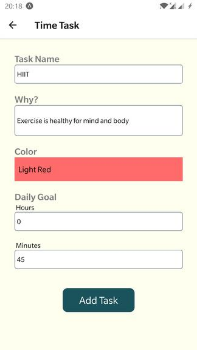
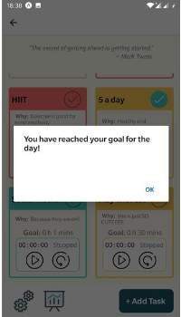
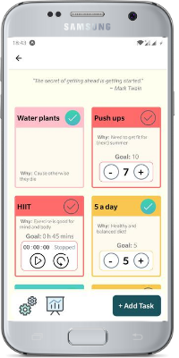
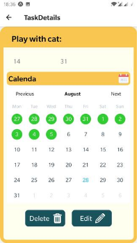

## Welcome to HabitUp! 🌱

### About HabitUp ⏱

HabitUp is a habit tracker, created with the one and only purpose of helping users create a new habit. 
 
Once in their dashboard, they can choose to create a New Task (habit) through filling in a form. 
The user journey starts in the main screen, where they can choose to see their tasks for the day or get inspired with quotes. 
The new task will automatically appear in their dashboard, where they can perform actions such as mark it as completed for the day, run a stopwatch set for the time goal, or manually enter the result in the counter. 
Clicking on a task redirects the user to a Task Details screen, where they can check out more details about their progress, such as streaks, and get a calendar view. 

 

### Running the project 🚀

**What you need:**

- Code editor (ex. Visual Studio Code)
- Web browser (ex. Chrome)
- Expo App installed on your phone.

#### Back end

1. Open the server folder and run `<npm i>` in the terminal.
2. Start the server by typing `<nodemon>` or `<node>` in your terminal.
3. This will launch the server and connect you to the database!

#### Front end

1. Open the client folder and run `<npm i>` in the terminal.
2. Start the app by typing `<npm start>`.
3. Open Expo App on your phone and scan the QR code.

And you are all set! 🎉

### Tech 👩‍💻

HabitUp has been created using:

**Front end:** React Native, Expo, CSS. 
**Back end:** Express, Node.js, PostgresQL, Sequelize.

🌳
